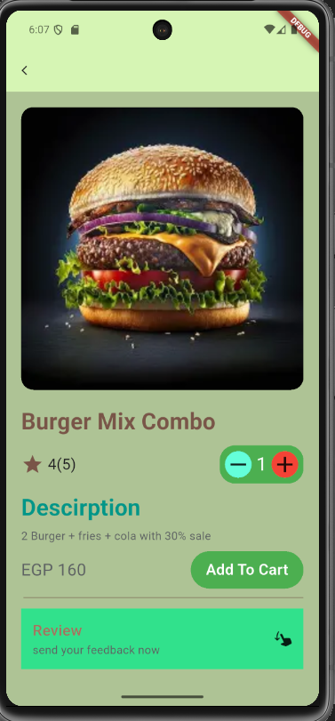

👀 Click to preview final README

# Burger-Mix-Combo Web App

> A tiny e-commerce demo that sells a fixed burger combo with 30 % off.  
Built to practise README writing, GitHub and basic CI/CD.

## 📖 Table of Contents
- [Features](#features)
- [Tech Stack](#tech-stack)
- [Quick Start](#quick-start)
- [Folder Structure](#folder-structure)
- [Available Scripts](#available-scripts)
- [Environment Variables](#environment-variables)
- [Contributing](#contributing)

## ✨ Features
- Add the “Burger Mix Combo” to cart in one click  
- Applies 30 % discount automatically  
- Shows live total in EGP  
- Persists cart in `localStorage`  
- Mobile-first responsive layout  
